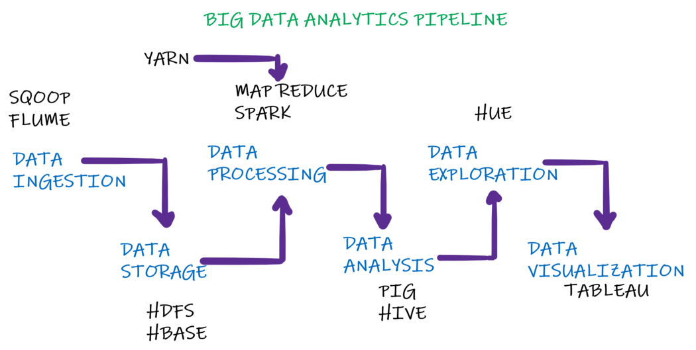

# 
<b>Big-Data-Analysis-using-the-Hadoop-Ecosystem</b>

Learn and implement the Hadoop Ecosystem to drive Big Data Analytics.

I've created a set of tutorials for you to begin your journey into the Big Data world.
If you're new to data engineering within the Hadoop Ecosystem, you've come to the right place!

  
 
Big Data Analytics Pipeline

  

The above image is the pipeline I'll be using/following for my upcoming tutorials on Big Data analytics using the Hadoop Ecosystem. To begin with, let’s learn about the architectures of each individual system/tool.

We'll build upon this knowledge by implementing a practical real-life project within the aviation domain. Now, for reference, I know very little about this domain, so this should be an interesting challenge to tackle not just for you but for me as well. I'm super excited, hope you're too...
  
First things first:

- Should you have any feedback/suggestion, please let me know.
- If you'd like to contribute, feel free to submit a pull request.
- Lastly, if you'd like for me to pick a specific topic as we go along, do not hesitate to connect with me on LinkedIN or through GitHub.
  

Oh and if you're new to Big Data, I highly recommend to go through the below in order. So, without further delay, let's begin...

 
 

## <b>Tutorials:</b>

1. Hadoop Distributed File System (HDFS)
    - [Comprehensive Guide](Data_Storeage/HDFS/Comprehensive_Guide.md)
    - [HDFS Commands](Data_Storeage/HDFS/Commands.md)
    - [HDFS Erasure Coding](Data_Storeage/Erasure_Coding.md)
2. [Sqoop](Data_Ingestion/Sqoop.md)
3. [Flume](Data_Ingestion/Flume.md)
4. [MapReduce](Data_Processing/MapReduce.md)
5. [Pig](Data_Analysis/Pig.md)
6. [Hive](Data_Analysis/Hive.md)
7. [HBase](Data_Storage/HBase.md)
8. [Spark](Data_Processing/Spark.md)
9. [Hue](Data_Exploration/Hue.md)
10. [Tableau](Data_Visualization/Tableau.md)
